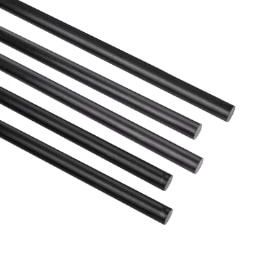
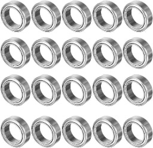
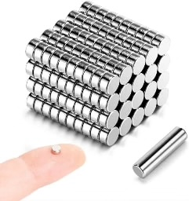
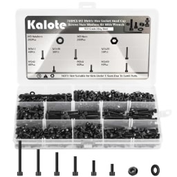
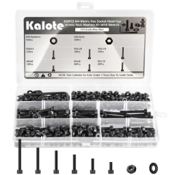
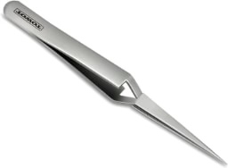
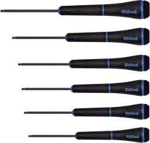

# Steady Hand Tool

**A stabilizing pick-and-place arm for precision SMD assembly.**

  
   
  <em>Steady Hand Tool — when you need help holding down really tiny parts.</em>

---

## 🛒 Bill of Materials (BOM)

The Steady Hand Tool is designed for easy sourcing. You can find the links and visual references for each component below (please notice that these are affiliate links).

### 🏗️ Structural Hardware

| Image | Item | Specification | Purpose |
| :---: | :--- | :--- | :--- |
|  | [**Carbon Fiber Rods**](https://amzn.to/4jpyyZC) | 8mm Diameter x 300mm (**4 required**) | 2 horizontal rails, 1 vertical mast, 1 vertical tool rod |
|  | [**MR128ZZ Bearings**](https://amzn.to/42kMWMD) | 8x12x3.5mm (14 required) | Frictionless carriage movement |
|  | [**Magnets**](https://amzn.to/4hq1puZ) | 4mm x 2mm Neodymium (56 required, buy 60) | Magnetic tool coupler interface. **Orientation matters** — see the [Magnet Polarity Standard](docs/magnet-polarity.md) |
| | **Base Ballast** | Round steel shot, **1.5 - 2.0 mm** (nominal 2.0 mm). Approx. **517 g** per base | Fills the printed base to **680 g ± 10 g**. The machined aluminium base needs none. **Size is not a preference** — read the note below before you buy any |

**Magnet count, broken down:** 24 in the base (four tool pockets, six each), 24 in the four
tool adapters, and 8 in the tool interface — 56 in total. Buy 60; they are small, and one
will find the floor.

**On the ballast, before you buy any.** The shot goes into the printed base through a **⌀8 mm
socket**, and that socket — not the chamber — is what governs. Granular flow arches when the
opening falls below roughly four particle diameters, so anything much over 2 mm bridges at the
mouth and leaves the outer chamber empty. At the other end, the chamber vents are ⌀1.5 mm and
finer shot runs straight back out. **So: 1.5 - 2.0 mm, nominal 2.0.** SAE **S-780** blasting shot
and **#9 steel reloading shot** both sit in that window.

**This entry used to link to 6.35 mm slingshot ammo, and it does not work.** A base filled with it
reaches about **619 g against the 680 g spec** — it bridges at the socket and packs to 49% where
a settled fill reaches 60%. The link has been removed rather than swapped, because the search
terms above are what you actually want. Fill by weighing the base, not by measuring the shot, and
tap or vibrate it between pours. Full method: [Step 1 of the assembly
guide](docs/assembly-guide.md#step-1-weight-the-base).

### 🔩 Fasteners

| Image | Item | Specification | Purpose |
| :---: | :--- | :--- | :--- |
|  | [**M3 Hardware**](https://amzn.to/42phRHt) | Stainless steel. **6x M3x16, 3x M3x20, 2x M3x10, 2x M3x8, and 7 nuts** | Structural assembly of the arm |
|  | [**M4 Hardware**](https://amzn.to/3WslSXP) | Stainless steel. **18x M4x16, 1x M4x10, and 19 nuts** | Structural assembly of the arm |

Buy a few spares of each size. **Neither base takes a fastener of any kind** — every one of these
goes into the arm. The step-by-step breakdown is in the
[assembly guide](docs/assembly-guide.md#-preparation-fasteners-sorting).

### 🔧 Tools

| Image | Item | Specification | Purpose |
| :---: | :--- | :--- | :--- |
|  | [**Reverse Tweezers**](https://amzn.to/4g4LjWo) | Needle-point, locking | Holding SMD parts during placement |
|  | [**Ball-Hex Drivers**](https://amzn.to/4jlawie) | Metric Allen Key Set | Recommended for assembly |
