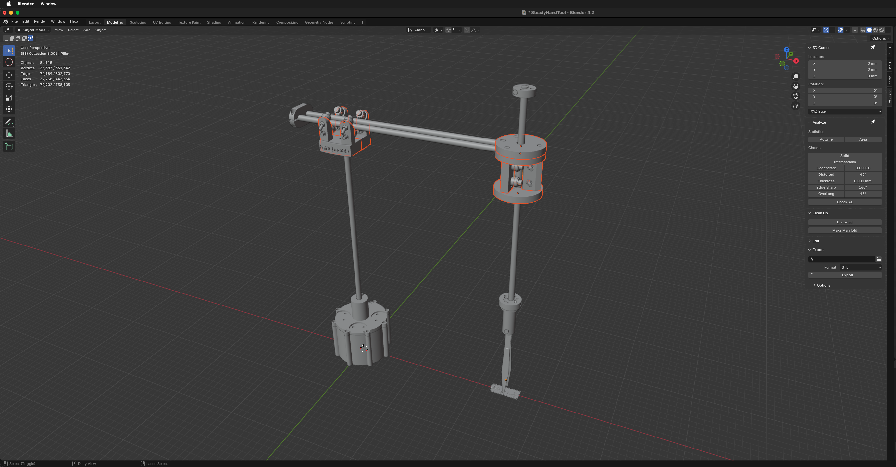

# SteadyHandTool

Open sourced models for SteadyHandTool, see https://halfmarble.com/blogs/news/steady-hand-tool for more info.

## Screenshots:

The 3D model (sorry - the highlighted parts are not open source yet)

The rest of models are releases under https://creativecommons.org/licenses/by/4.0/

